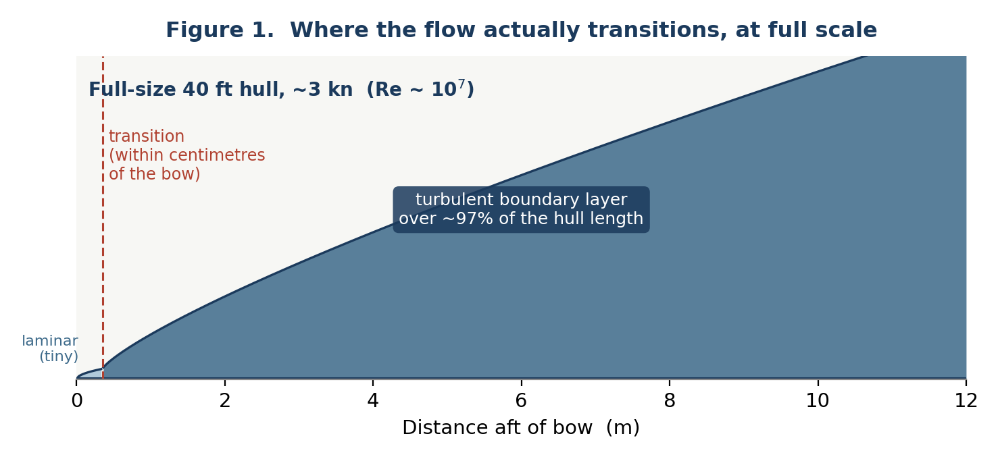
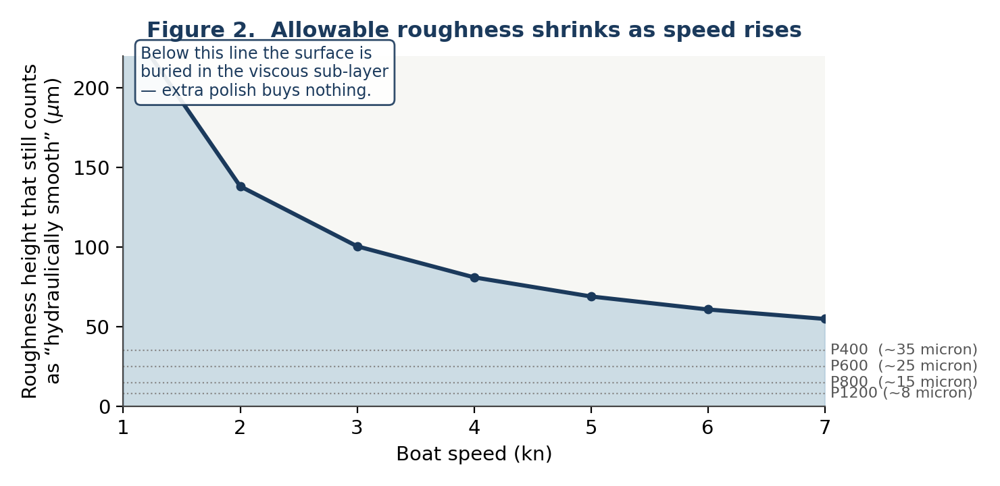
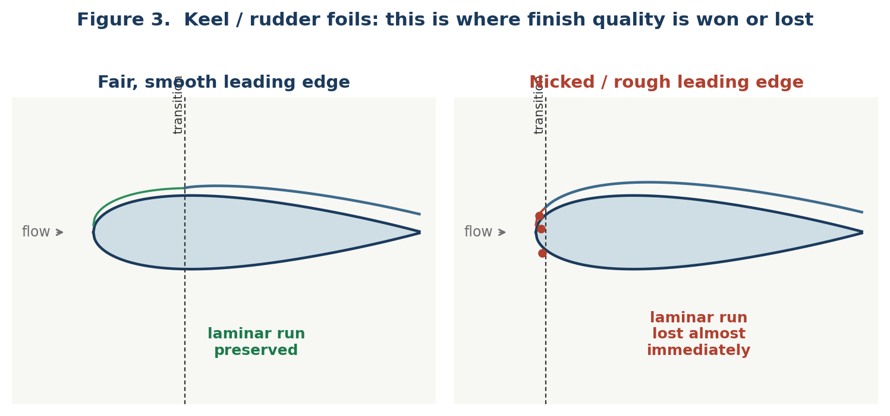
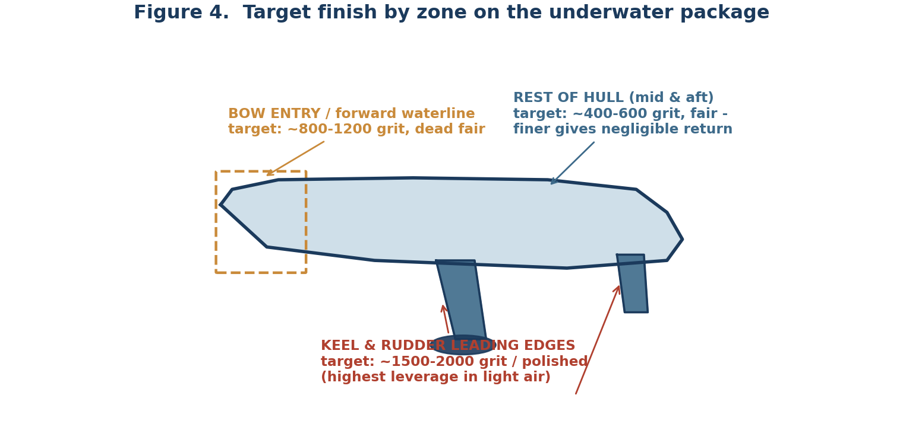

# Surface Finish & Boundary Layer Strategy

*For the 40 ft non-displacement gennaker boat — light-air / displacement-speed regime (0–7 kn)*

We are weak in light air and want outright speed. This note works out, from first-principles boundary-layer physics plus published testing, what grit of finish is actually worth chasing on a 40 ft raceboat between 0 and 7 knots, and whether the hull, keel/bulb, and rudder(s) deserve the same treatment.

**Short answer: no** — the hull and the appendages sit in genuinely different flow regimes, so they get different strategies.

---

## 1. Why the hull and the foils are different problems

Whether a boundary layer can stay laminar depends on the Reynolds number, Re = U·L/ν (speed × length over kinematic viscosity of seawater, ν ≈ 1.19×10⁻⁶ m²/s). Natural transition on a smooth flat plate in quiet flow happens around Re ≈ 5×10⁵–10⁶. Model yachts and dinghies (waterline <1–2 m) sail at Re ≈ 10⁴–10⁶, i.e. right around that transition point — which is exactly why the well-known model-yacht polishing studies (Klaka et al.) find that a mirror finish can preserve laminar flow over a large fraction of the hull.

A 40 ft hull is a different animal. Even loafing along at 2–3 kn (≈1–1.5 m/s) over a ≈12 m waterline, length-based Re is already ≈10⁷. At that Re the boundary layer trips to turbulent within the first few percent of the waterline — centimetres, not metres — and any wave/chop disturbance at the free surface forces it even earlier. The figure below shows this schematically: the laminar patch at the bow is real but tiny, and essentially the entire hull runs a turbulent boundary layer regardless of how well it is polished.

*Figure 1. Boundary-layer development along a 40 ft waterline. At full-size Re, transition happens almost at the bow — there is no meaningful laminar run to "protect" on the hull itself.*

The keel fin, bulb and rudder blades are a different story. Their chord is short (roughly 1.5–2.5 m at the keel root, less at the rudder), so chord-based Re at 3–5 kn is only ≈10⁶–10⁷, and their sections (typically NACA 63/64-series or similar) are deliberately shaped with a favourable pressure gradient to hold laminar flow over the front 20–30% of chord. That laminar run is a genuine, achievable drag saving on a boat this size — but only if the leading edge and forward third of the section are smooth and fair. **This is the single biggest surface-finish lever you have.**

---

## 2. The hull: chase "hydraulically smooth", not "mirror"

Once the flow is turbulent (i.e. everywhere on the hull beyond the first few centimetres), roughness only matters if it pokes up through the viscous sub-layer — the thin near-wall film where the flow is still smooth. Roughness buried below that sub-layer is invisible to the flow; polishing it finer buys nothing. The sub-layer gets thinner as speed rises, so the smoothness you actually need is speed-dependent, as shown below.

*Figure 2. Roughness height that still counts as hydraulically smooth, vs. boat speed (order-of-magnitude, from boundary-layer sub-layer scaling). Grit-to-micron bands are approximate FEPA P-grade averages.*

Across 2–7 kn that threshold sits roughly in the 50–150 micron band, comfortably covered by a fair, wet-sanded **400–600 grit** finish. This matches practical race-prep experience: hard antifoul burnished/wet-sanded to 400–800 grit is the normal ceiling for boats kept in the water, and even drysailed epoxy-finished bottoms are usually argued no finer than 800–1000 grit before the returns vanish. Sanding a hull to 1200–2000 grit is not wrong, just wasted labour for this reason.

What matters more than micro-roughness on the hull is **macro-fairness**: long-wavelength print-through from core/frame lines, ridges at antifoul build-up, and waviness around the keel root and waterline. A slightly-rough-but-dead-fair bottom beats a glassy-but-wavy one, especially in light air where any extra wetted-surface disturbance shows up immediately as reduced glide.

---

## 3. Appendages: where finish quality is actually won or lost

*Figure 3. A rough or nicked leading edge trips the boundary layer almost immediately, destroying the laminar run the section was designed to have. The loss is proportionally much larger here than an equivalent roughness would cost on the (already turbulent) hull.*

Because a genuine laminar run is physically available on the keel, bulb and rudders in this speed range, surface defects there are far more expensive than the same defects on the hull. **Fairness comes first** — any ripple ahead of the section's minimum-pressure point (roughly the first third of chord) will trip transition regardless of polish, so check with a fairing batten / straightedge before worrying about grit. Once fair, work the leading edge and forward third of chord up through a full progression (120 → 240 → 400 → 800 → 1200, and 1500–2000 or a polished epoxy/Awlgrip-type finish if class rules and haul-out logistics allow bare-finish rather than antifoul). Aft of the design transition point the flow is turbulent anyway, so it can be treated like the hull (400–600 grit).

One caveat: in a genuine seaway rather than flat water, ambient turbulence intensity itself can suppress laminar flow on the foils, the same way it does in the model-yacht tank-vs-open-water comparisons. The appendage-finish strategy pays off most in the flat-water light-air situations — which is exactly the condition where the boat is reportedly weakest.

---

## 4. Summary — what to actually do

| Zone | Priority | Target finish | Notes |
|---|---|---|---|
| Keel fin & bulb (leading edge, fwd 1/3 chord) | **Highest** | 1500–2000 grit or polished epoxy | Fair first with a batten; this is the real laminar-flow win |
| Rudder(s) (leading edge, fwd 1/3 chord) | **Highest** | 1500–2000 grit or polished epoxy | Same logic as keel; don't neglect for "low load" reasons |
| Bow entry / fwd 10–15% waterline | Medium | 800–1200 grit, dead fair | Sets local transition point; fairness > micro-polish |
| Rest of hull (mid & aft) & aft 2/3 of foil chord | Low | 400–600 grit, fair | Flow is turbulent regardless; finer grit is wasted effort |

*Figure 4. Target finish by zone on the underwater package.*

**In one line:** don't spend more sanding hours on the mid/aft hull than it takes to get to a fair 400–600 grit — put the saved time into fairing and polishing the keel, bulb and rudder leading edges, since that is the one place on this boat, in this speed range, where a real laminar boundary layer is physically available and worth protecting.

---

## References

- Klaka, K. et al., "Roughness for Model Yachts" (updated 2023), Klaka Marine / One Metre class technical papers. Model-scale (Re ≈ 10⁴–10⁶) roughness/grit study; source for the sub-layer roughness-vs-speed reasoning used in Figure 2 and for the still-water vs. open-water laminar-flow comparison. <https://klakamarine.org/>
- SailZing, "Hull Smoothness – What Matters for Speed?" Practical summary of speed-dependent grit targets (1200–1500 grit for light air / laminar attempts vs. 400 grit once flow is turbulent). <https://sailzing.com/hull-smoothness-what-matters-for-speed/>
- International GP14 Class Association, "A Smooth Bottom Is a Fast Bottom." Dinghy-class prep guidance on hull fairing and finish sequence. <https://gp14.org/2018/01/07/a-smooth-bottom-is-a-fast-bottom/>
- Yachting World, "5 Tips: Faster Foils – Keel and Rudder." Full-size race-boat foil prep: grit progression (120/240 → 400 → 1000) and epoxy paint systems for drysailed keels/rudders. <https://www.yachtingworld.com/5-tips/5-tips-faster-foils-make-sure-keel-rudder-tip-top-condition-71194>
- Practical Sailor, "A Fast Bottom Paint Finish." Test data on antifoul burnishing/wet-sanding (400–800 grit) for racing vs. cruising bottoms. <https://www.practical-sailor.com/boat-maintenance/a-fast-bottom-paint-finish/>
- General boundary-layer / ship-hydrodynamics background (Reynolds-number scaling, viscous sub-layer, hydraulically smooth criterion): standard naval-architecture treatment, e.g. Larsson & Eliasson, *Principles of Yacht Design*, and Schultz, M.P., "Effects of Coating Roughness and Biofouling on Ship Resistance and Powering," *Biofouling* (2007).

*Note: figures in this document are original schematic diagrams created to illustrate the physical reasoning above (boundary-layer growth, sub-layer roughness scaling, foil transition, and zone summary); the numeric curves are order-of-magnitude illustrations of the cited boundary-layer theory and test data, not a CFD result for this specific hull.*
